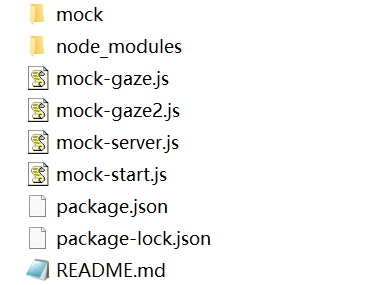

[TOC]

> 这个项目是为了前后端分离开发，使用`mock`+`nodejs`编写的模拟后端数据的服务，同时添加了同步上传到服务器上的功能
github地址：[mock-server](https://github.com/LicaiMaker/mock-server.git)
### 目录简介



- `mock` 里面存放的都是接口文件/文件夹(里面的接口数据都是用`mock`模拟的)
- `node_modules`使用的是`npm`安装的依赖库
- `mock-gaze.js` 用于监听文件的变化并上传到服务器(使用`gaze`+`scp2`实现)(已废弃)
- `mock-gaze2.js `用于监听文件的变化并上传到服务器(使用`chokidar`+`scp2`实现)
- `mock-server.js` 核心文件，使用`express`实现，该文件中会搜索`mock`中的所有接口文件
- `mock-start.js`使用`nodemon`模块，在项目修改代码后，自动重启

### 使用

#### 在本地启动接口

如果只在本地使用，则直接执行：

```shell
node mock-start.js
```

然后就可在浏览器中通过`localhost:8090/api1`来访问接口了

并且可以实时修改代码，自动重启

#### 本地监听，并且上传到服务器，并且在远端服务器启动该接口服务

- 首先修改`mock-gaze2.js`中服务器的配置

```js
// mock-gaze2.js
...
var client = require('scp2')
let log = console.log.bind(console)
...

function uploadFile(localPath,remotePath){
	// 这里的地址自行更改成自己的服务器
	client.scp(localPath, 'username:password@ip_address:'+remotePath, function(err) {
		log(`${localPath} 上传成功..`) 
})
}
```

- 启动监听

```shell
node mock-gaze2.js
```

> 这里监听的目录上当前目录（除node_modules文件夹，可在`mock-gaze2.js`中配置），所以`node_modules`的变化不会被监听，并且也不会上传到远端服务器

然后就能监听到该目录下的所有变化了，然后变化的部分会被上传到远端服务器了

- 在远端启动接口服务

  虽然现在上传到了远端服务器，但是我们要的效果是，本地修改，同步到远端服务器，然后通过`ip`或域名可以访问远端的接口，所以需要在服务器上启动接口服务(即：在服务器上执行`node mock-start.js `)

  但是呢，现在没有上传`node_modules`文件夹，故需要在服务器上安装一下依赖库

  ```
  npm install 
  ```

  然后：

  在服务器上启动`mock-start.js`

  ```js
  node mock-start.js
  ```

  这样就能在本地修改，并同步到远端了

> tip: 如果需要接口服务持久的运行在服务器上呢，可以使用forever库来启动`mock-start.js`:
>
> ```js
> npm install forever
> forever start mock-start.js
> ```
>
> 


### 附录

`mock`接口文件编写规范：

在`mock`目录下创建`api.js`

`mock/api.js`：

 ```js
const Mock=require('mockjs')
// 下面使用mockjs的语法
let getApi1Data=(req)=>{
	return Mock.mock({
	"list|2-5":[{
		"name|1":"@name()",
		"id|+1":1,
		"isMale|1":true 
	}]
	}) 
}  
  

module.exports={
	// 固定格式 [`方法 url`](req,res){res.status(200).json(mock方法名(req))}
	[`GET /api`](req,res){
		res.status(200).json(getApi1Data(req))
	}
}
 ```

`mock`语法：https://github.com/nuysoft/Mock/wiki

> 当然可以支持多文件夹，在`mock`目录下可以使用多个文件夹来存放接口文件，以达到模块化的需求

